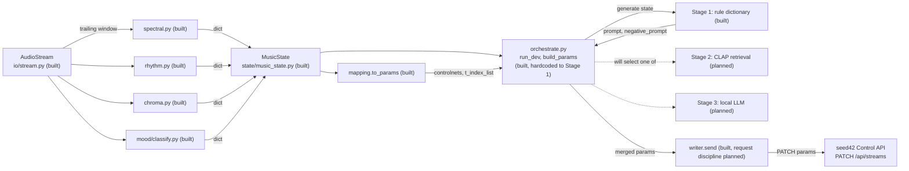
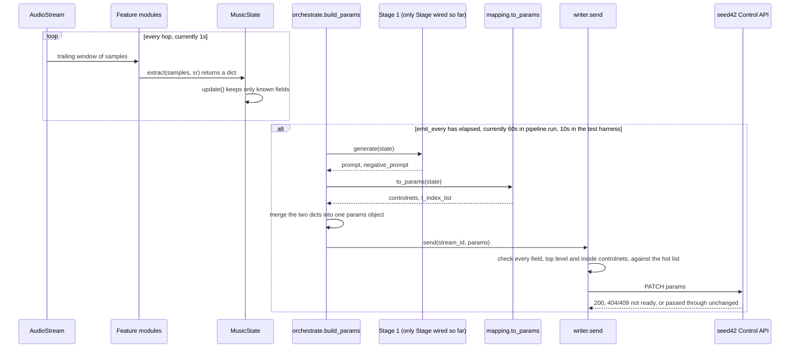
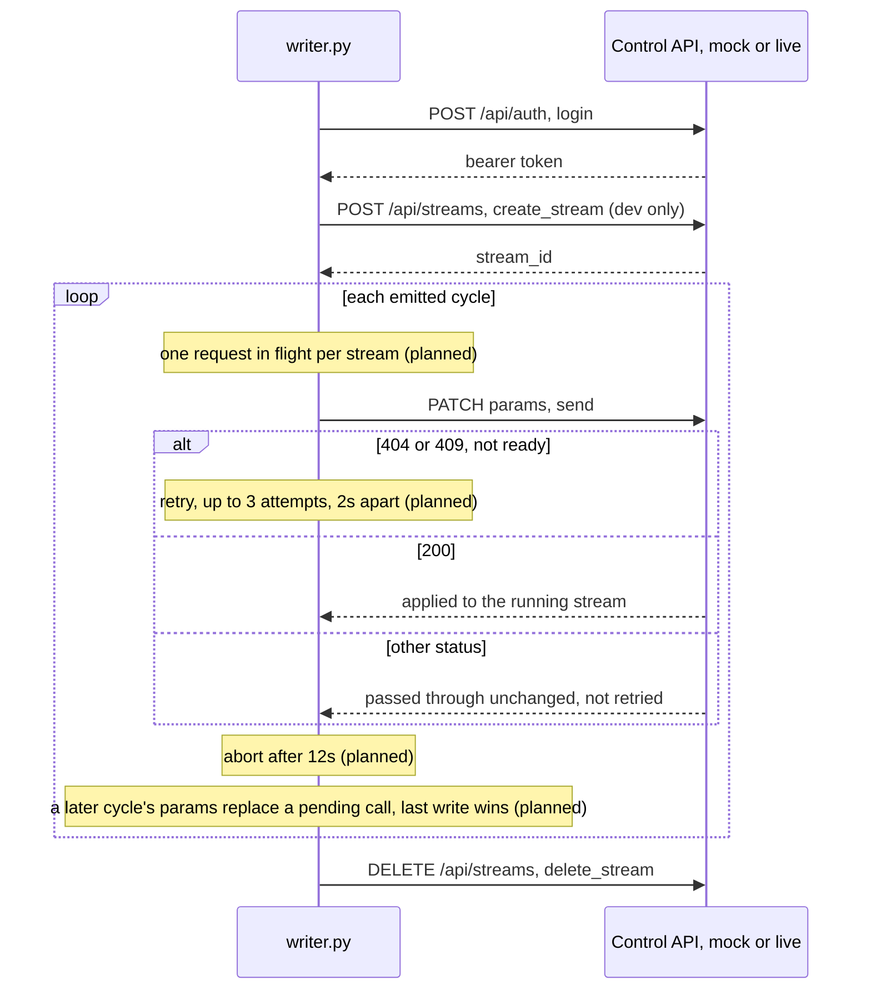

# D3 Design Document: seed42 Audio Module

**Project:** seed42, real time audio analysis and prompt generation (COMP3850 PACE, Group 21)
**Owner:** Philopateer Sedrak
**Repository:** seed42-audio

This document is the Solution Architecture, Feature Engineering, Algorithm/Models/Methods
and Detailed Data Description sections of the Deliverable 3 Project Documentation (Data
Science stream). Testing and evaluation are covered separately in the Test Cases document
(Hatim Hussaini). Deployment and handover are covered in Deliverable 4.

It documents the pipeline as built where the code already exists, against `main` as of
this draft, and clearly marks what is still designed but not yet implemented, since the
rest of the Part 2 build (Stage 2, Stage 3, configurable Stage selection, and the writer's
request discipline) runs over the break, 24 September to 1 October. A note on terms: this
document always says Stage 1, Stage 2 and Stage 3, never Tier, to match the naming used in
the code and the D3 task assignments, even though earlier planning notes used Tier 0/1/2
for the same three approaches.

## Revision history

| Rev | Date | Author | Change |
|---|---|---|---|
| 0.1 | 2026-09-21 | Philopateer Sedrak | First draft, written against `main` at commit `8d5cf47` (orchestrator wired, MusicState keeps bass_energy/onset_times/beat_times, nested cold-field check added) |

## Table of contents

1. Purpose and scope
2. Solution architecture
3. The seam
4. Data: MusicState and feature engineering
5. The three Stages
6. The mapping
7. The writer and the session lifecycle
8. Assumptions, gaps and open items
9. References

## 1. Purpose and scope

This document explains how the seed42 audio module turns a live or recorded audio feed
into the parameters seed42's visual engine reads, and why it is built this way. The
intended audience is the marker, the sponsor, and any teammate picking up a part of the
pipeline they did not write themselves.

Scope matches AGENTS.md: this module analyses audio and produces a classification, a
prompt and a set of slider values. It does not touch rendering. seed42 already owns the
renderer and the WebRTC stream; our module only ever calls one REST endpoint against it.

## 2. Solution architecture

The pipeline is a loop, not a one-shot script. Every `hop` seconds it reads the trailing
`window` seconds of audio and turns that into a `MusicState` reading. Every `emit_every`
seconds (a slower cycle than the feature loop), the orchestrator turns the current state
into a prompt and a set of slider values and sends them to seed42.

The per-window flow, one cycle:

Resource notes: `window` and `hop` are currently 30s and 1s in `pipeline.run`'s default
arguments (6s and 1s in the separate `run_stream.py` smoke test), and `emit_every` is 60s
in the default entry point but 10s in the D3 test harness, since a 60s cycle would not
complete even once against the 45 second `test.wav` clip. None of these are confirmed
production values; they are expected to be tuned once latency is benchmarked, per the
project's own research notes.

`orchestrate.py` is the one place that assembles a whole window's params: it calls a
Stage for prompt text, the mapping for sliders, merges the two dicts into one params
object, and hands that to the writer. Today `run_dev()` hardcodes Stage 1
(`from .stages import stage1`) as the entry point for local development against the mock;
making the running Stage configurable is the remaining piece of Jayden's Part 2 work.

## 3. The seam

The seam is the set of shapes that let every piece of the pipeline be replaced without
touching its neighbours. It is written up in full in `docs/seam-contract.md`, drafted on
the `docs-cleanup` branch (not yet merged into `main` as of this document, see section 8).
Summarised here, with this document's own check against the actual code:

1. **MusicState**, `state/music_state.py`. One dataclass, one instance per window. Every
   feature module returns a plain dict; `MusicState.update()` copies in only the keys
   that match a declared field, so a module can return extra keys safely (they are
   ignored) but cannot add a new field just by returning it.
2. **`generate(state) -> dict`**, the signature every Stage shares, returning
   `{"prompt": ..., "negative_prompt": ...}`. No API calls, no stored state. Because all
   three Stages take only `state` and hold no memory between calls, the orchestrator can
   select whichever Stage is configured to run without any of them knowing about the
   others. This also keeps Stages causal by construction: a Stage can only see what is
   already on the `MusicState` it was handed, never a previous window's own state.
3. **`to_params(state) -> dict`**, the mapping's equivalent contract, in
   `output/mapping.py`, returning slider fields only.
4. **The writer is dumb transport**, `output/writer.py`: `login()`, `create_stream()`,
   `send(stream_id, params)`, `delete_stream(stream_id)`. It applies the hot field
   allow list and PATCHes. It never merges a Stage's output with the mapping's output,
   and it never generates prompt text; that merge is the orchestrator's job (section 2).

Because generate() and to_params() only ever take `state` and return dicts, building
Stage 2 and Stage 3 is additive: neither one needs to change MusicState, the writer, or
(once Stage selection lands) the orchestrator's wiring.

## 4. Data: MusicState and feature engineering

`MusicState` is the single record a window's worth of audio becomes. It is not persisted;
each instance exists only for the window it describes, and is either logged (as JSON, via
`to_json()`) or consumed by a Stage and the mapping, then discarded.

| Field | Type | Produced by | Range or values | Status |
|---|---|---|---|---|
| timestamp | float | pipeline.py | seconds, trailing edge of the window | built |
| tempo | float | features/rhythm.py | BPM, roughly 60 to 200 | built. Reads 129.2 BPM against a 120 BPM click track, owing to frame quantisation, flagged for evaluation |
| energy | float | features/spectral.py | RMS amplitude, roughly 0 to 0.3 for normalised audio | built. Called `loudness` inside spectral.py, renamed to `energy` to match MusicState |
| brightness | float | features/spectral.py | spectral centroid, Hz, roughly 500 to 4000 | built |
| flatness | float | features/spectral.py | 0 to 1, noise-like versus tonal | built, not yet read by any Stage or the mapping |
| key | str | features/chroma.py | pitch class, for example "C", "C#" | built, not yet read by any Stage (Stage 1's docstring flags this as a deliberate omission, open to revisiting) |
| mode | str | features/chroma.py | "major" or "minor" | built |
| valence | float | mood/classify.py | -1 to 1 | built. Essentia's pretrained DEAM model is the primary path, a brightness/energy/mode heuristic is the automatic fallback |
| arousal | float | mood/classify.py | -1 to 1 | built, same fallback pattern |
| bass_energy | float | features/spectral.py | 0 to 1, share of spectral energy under 250 Hz | built. Previously computed and silently dropped by MusicState, now a declared field |
| onset_times | list[float] | features/rhythm.py | seconds within the segment | built. Kept on the object for the mapping and later Stages, but deliberately left out of the compact `to_json()` log line |
| beat_times | list[float] | features/rhythm.py | seconds within the segment | built, same as onset_times |
| chroma | 12-vector | features/chroma.py computes it | normalised chroma vector | still computed but dropped, MusicState has no matching field |
| samples | ndarray | not yet produced | the raw audio window itself | planned for Part 2 (Jayden, confirmed in docs/seam-contract.md), needed so Stage 2 has the waveform, not just scalars |

Feature engineering choices worth recording:

- **Energy banding and mood quadrant (Stage 1)**: energy is split into low, mid and high
  bands over the same 0 to 0.3 RMS range mood/classify.py normalises against, so a "high
  energy" reading means the same thing in both places. Mood quadrant comes from valence
  and arousal sign, Russell's circumplex convention (negative valence darker or sadder,
  negative arousal calmer), with both treated as neutral (0.0) when not yet known rather
  than erroring.
- **Mode from chroma**: both chroma.py and mood/classify.py's fallback path estimate
  major versus minor by correlating a chroma vector against the twelve rotations of the
  Krumhansl-Schmuckler major and minor profiles and keeping the stronger match. They are
  implemented independently rather than one calling the other, see the redundancy note in
  section 8.
- **Redundant computation**: mood/classify.py's fallback recomputes its own brightness,
  energy and mode from raw samples rather than reading spectral.py's or chroma.py's
  output, because `extract(samples, sr)` is never given the state those modules have
  already filled in. This is a known, previously raised issue, see section 8.

## 5. The three Stages

All three Stages implement `generate(state) -> dict`, described in section 3. They differ
only in how they turn a `MusicState` into a prompt.

**Stage 1, rule dictionary** (`stages/stage1.py`, built, and wired into `orchestrate.py`).
No model, no API call, no stored state between calls. Three small phrase tables, joined
per call:

- a mood quadrant table (bright/dark by energetic/calm) driving the main prompt and
  negative prompt phrase,
- a mode table (major/minor) colouring the prompt only,
- an energy band table (low/mid/high) adding a motion phrase.

The file's own docstring explains the design tradeoff: a single nested table, one entry
per quadrant/mode/band combination, would be twelve times two times three entries; three
small tables joined into one line means tuning one phrase touches one line, not several
near-duplicates. Key (the pitch class) is available on MusicState but is deliberately
unused here, flagged in the file as an assumption to revisit if the seam ever wants it.

**Stage 2, CLAP retrieval** (`stages/stage2.py`, planned, Charminkumar Patel, Part 2
priority P1). CLAP embeds audio and text into a shared space. The plan: embed a bank of
candidate phrases once at startup, embed the current window each cycle (this is the main
reason MusicState needs the planned `samples` field, retrieval needs the waveform, not
just the scalar features), retrieve the closest phrases per phrase group by nearest
neighbour, and assemble a prompt from them. Falls back to Stage 1 if CLAP is unavailable
or a window takes longer than the cycle budget, the same fallback pattern
mood/classify.py already uses for Essentia.

**Stage 3, local LLM** (`stages/stage3.py`, planned, Ngoc Nhat Pham, Part 2 priority P1).
A locally hosted LLM (Ollama, Llama 3 or Mistral) receives the structured MusicState and
is prompted to write freer prompt language, returning JSON with guardrails so a malformed
reply can never reach the writer. A local model was chosen over a hosted API to avoid
per-call cost and an internet dependency at a live event.

**Stage selection**: `orchestrate.py` exists and runs end to end against the mock, but
`run_dev()` currently imports and calls Stage 1 directly. Adding configurable Stage
selection, and building Stage 2 and Stage 3 themselves, is the remaining Part 2 P1 work.

## 6. The mapping

`output/mapping.py`'s `to_params(state)` turns the same `MusicState` a Stage reads into
seed42's slider fields, as built:

| Slider | Field sent | Formula, as built | Driven by |
|---|---|---|---|
| Depth | `controlnets[0].conditioning_scale` | clamp(brightness / 3000, 0, 1) | brightness |
| Edge | `controlnets[1].conditioning_scale` | clamp(tempo / 200, 0, 1) | tempo |
| Consistency | `controlnets[2].conditioning_scale` | clamp(1 - energy, 0, 1) | energy, inverted so calmer music holds frames steadier |
| Creativity | `t_index_list[0]` | 19 minus clamp(int(arousal * 19), 0, 19) | arousal, then inverted |

The Creativity inversion is not a bug: seed42's interface shows Creativity as the number a
person tunes, but a low `t_index` is what makes the image diverge further from the camera
feed, so a high Creativity reading has to become a low `t_index`, exactly as
docs/seam-contract.md documents.

Known limitations, matching Tatiana's Part 2 priority P2 task: Edge is currently driven by
tempo as a proxy for rhythmic motion rather than real beat strength, and Depth uses
brightness rather than bass_energy, even though both onset_times/beat_times and
bass_energy now survive on MusicState (section 4) and are available to use. `t_index_list`
is also emitted as a Python list (`[t_index]`) rather than the comma-separated string the
current sponsor guide expects; docs/seam-contract.md flags this explicitly and notes the
mock does not check the type, so the mismatch passes in development and would only
surface against the real API.

## 7. The writer and the session lifecycle

`output/writer.py` is the only part of the module that talks to seed42. It does not
decide what to send or merge a Stage's output with the mapping's, the orchestrator does
that (section 2); it only builds the request, checks it, and sends it.

Built: `login()` (POST /api/auth with credentials from the environment, never the repo,
returns a bearer token good for 30 days), `create_stream()` (development only, seed42
hands the module a `stream_id` directly in production), `send(stream_id, params)`, and
`delete_stream(stream_id)`. `send()` checks every top-level key in `params` against
`HOT_FIELDS`, and also checks inside every `controlnets` entry against
`ALLOWED_CONTROLNET_FIELDS`, raising `ColdFieldError` if anything outside those sets is
present, since the real API answers 200 and reloads anyway rather than rejecting a cold
field. This nested check is what closes the gap the D3 task list flagged, a cold field
such as `model_id` hidden inside a `controlnets` entry is now caught before it is sent.

Not yet built: the request discipline docs/seam-contract.md specifies, one request in
flight per stream with last-write-wins if a new cycle's params arrive while a call is
still open, a 12 second abort, retrying only a not-ready 404 or 409 (up to 3 attempts, 2
seconds apart, nothing else retried). `send()` today is a single blocking
`requests.patch` call with no timeout and no retry, so a slow or dropped response
currently stalls the whole pipeline loop rather than being aborted and superseded. Danial
Sarfraz's Part 2 priority P1 task is exactly this hardening.

Testing: `scripts/mock-control-api.py` can simulate the four failure modes the client
must survive before live access, `--not-ready 404`, `--not-ready 409`, `--async-create`,
`--unstable`, plus an injectable `--fail-rate`. `tests/harness.py` starts the mock, runs
one pipeline session against `data/test.wav`, and captures both processes' output to
`tests/logs/` (gitignored); it is a scaffold with no assertions yet, turning it into real
assertions against each mock mode is Hatim's Part 2 work.

## 8. Assumptions, gaps and open items

- **docs/approach.md is empty**, on `main` and still on the `docs-cleanup` branch. The D3
  task assignments name it as the source of truth for the contract, but the team appears
  to have superseded it with `docs/seam-contract.md` instead (see next point). Worth
  formally retiring docs/approach.md, or redirecting README.md's pointer, once
  docs-cleanup merges, so task briefs and the README stop pointing at an empty file.
- **docs/seam-contract.md exists and is thorough, but is not yet on `main`.** It is
  drafted on the `docs-cleanup` branch, which also removes stale WORKLOG rows and the
  original sponsor PDFs from docs/. This document's section 3 is a summary of it, checked
  against the current code. Worth merging soon, since Part 2 tasks (Jayden's orchestrator
  work, Danial's request discipline, Tatiana's mapping refinement) all assume a written
  contract that is currently only on a branch. One small inconsistency to fix while
  merging: docs/seam-contract.md refers to the sponsor's external spec as
  `control-api.md`, but the actual file is `docs/seed42_api.md`.
- **docs/seed42_api.md and docs/seam-contract.md disagree on `ip_adapter`.** The older
  summary (seed42_api.md, 25 August) lists `ip_adapter.*` as hot fields. The newer
  contract (seam-contract.md) treats `ip_adapter` as unconfirmed against the current
  sponsor guide and says not to send it. This document follows seam-contract.md, per its
  own stated rule that it overrides older docs where they disagree, and does not include
  `ip_adapter` anywhere above.
- **MusicState still drops the chroma vector.** bass_energy, onset_times and beat_times
  are now kept (this pull), and `samples` is explicitly scoped for Part 2. The chroma
  vector chroma.py computes is not on the dataclass and is not scoped anywhere yet, worth
  raising alongside the `samples` field since it is the same kind of fix.
- **Feature duplication in mood/classify.py's fallback.** It recomputes brightness,
  energy and mode itself rather than reading spectral.py's or chroma.py's output, since
  `extract(samples, sr)` is never given the state those modules have already filled in.
  A fix was proposed earlier (passing the partially built state into `extract()` as an
  optional third argument, backward compatible) but has not been actioned or signed off
  by Jayden, whose `pipeline.py` owns that interface.
- **Mapping constants are provisional.** The brightness range (0 to 3000 Hz) and tempo
  range (0 to 200 BPM) used to scale Depth and Edge are estimates, not yet benchmarked
  against real tracks.
- **No design-specific Deliverable 2 feedback exists yet** to fold in, D2 has not been
  marked as of this draft. The process feedback that is available, branch per task, one
  approval before merge into main, no direct pushes, is already reflected in how this
  document itself is written and committed.

## 9. References

- `AGENTS.md`, hard constraints (causal only, stable MusicState interface, style rules)
- `docs/seam-contract.md` (branch `docs-cleanup`), the internal seam and architecture contract
- `docs/seed42_api.md`, the Control API summary (superseded in part by seam-contract.md, see section 8)
- D3 Part 2 task assignments (seed42 Audio Module, D3 Part 2 Task Assignments)
- `src/seed42_audio/state/music_state.py`, `pipeline.py`, `orchestrate.py`, `io/stream.py`
- `src/seed42_audio/features/spectral.py`, `rhythm.py`, `chroma.py`, `mood/classify.py`
- `src/seed42_audio/stages/stage1.py`
- `src/seed42_audio/output/mapping.py`, `writer.py`
- `scripts/mock-control-api.py`, `tests/harness.py`
