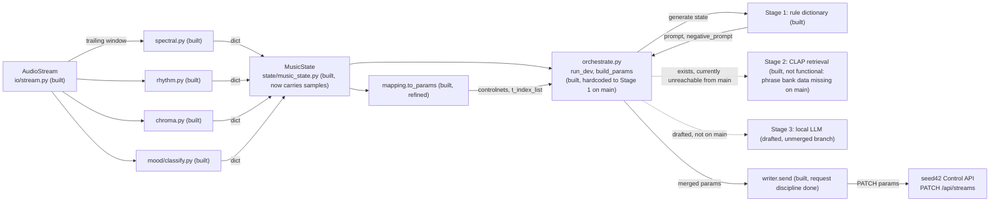
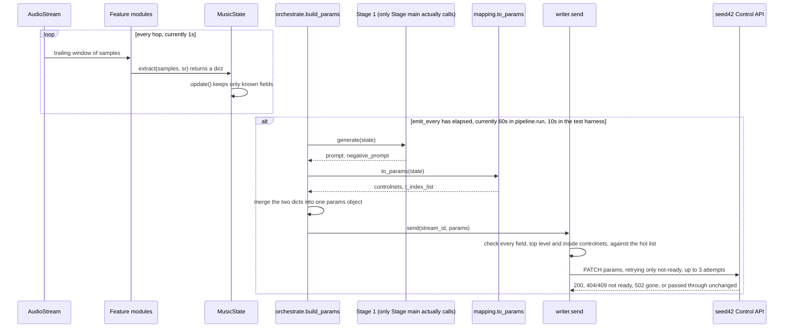
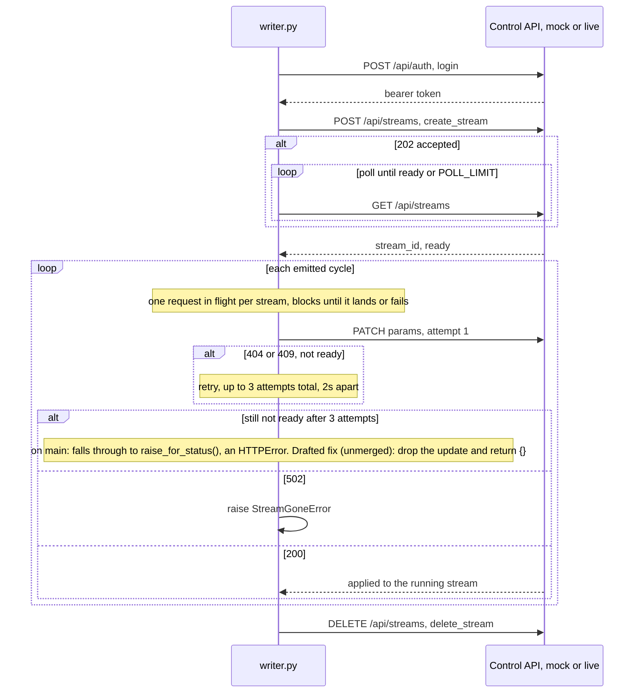

# D3 Design Document: seed42 Audio Module

**Project:** seed42, real time audio analysis and prompt generation (COMP3850 PACE, Group 21)
**Owner:** Philopateer Sedrak
**Repository:** seed42-audio

This document is the Solution Architecture, Feature Engineering, Algorithm/Models/Methods
and Detailed Data Description sections of the Deliverable 3 Project Documentation (Data
Science stream). Testing and evaluation are covered separately in the Test Cases document
(Hatim Hussaini). Deployment and handover are covered in Deliverable 4.

It documents the pipeline as built where the code already exists on `main`, and clearly
marks what is drafted on a branch but not yet merged, or still just designed. A note on
terms: this document always says Stage 1, Stage 2 and Stage 3, never Tier, to match the
naming used in the code and the D3 task assignments.

## Revision history

| Rev | Date | Author | Change |
|---|---|---|---|
| 0.1 | 2026-09-21 | Philopateer Sedrak | First draft, written against `main` at commit `8d5cf47` (orchestrator wired, MusicState keeping bass_energy/onset_times/beat_times, nested cold-field check added) |
| 0.2 | 2026-09-29 | Philopateer Sedrak | Updated against `main` at commit `f25bfa1`, one week into the Part 2 build. Stage 2 (CLAP retrieval), the writer's request discipline, and the mapping refinement have all landed. seam-contract.md and docs-cleanup are merged. Stage 3 and configurable Stage selection are drafted on the unmerged `stage3-and-selection` branch. Records a newly found bug (`MusicState.to_json()` crashes now that `samples` is always populated) and a gap (Stage 2 is merged but not functional on `main` because its phrase bank data file was never committed) |

## Table of contents

1. Purpose and scope
2. Solution architecture
3. The seam
4. Data: MusicState and feature engineering
5. The three Stages
6. The mapping
7. The writer and the session lifecycle
8. Assumptions, gaps and open items
9. References

## 1. Purpose and scope

This document explains how the seed42 audio module turns a live or recorded audio feed
into the parameters seed42's visual engine reads, and why it is built this way. The
intended audience is the marker, the sponsor, and any teammate picking up a part of the
pipeline they did not write themselves.

Scope matches AGENTS.md: this module analyses audio and produces a classification, a
prompt and a set of slider values. It does not touch rendering. seed42 already owns the
renderer and the WebRTC stream; our module only ever calls one REST endpoint against it.

## 2. Solution architecture

The pipeline is a loop, not a one-shot script. Every `hop` seconds it reads the trailing
`window` seconds of audio and turns that into a `MusicState` reading. Every `emit_every`
seconds (a slower cycle than the feature loop), the orchestrator turns the current state
into a prompt and a set of slider values and sends them to seed42.

```mermaid
flowchart LR
    AS["AudioStream<br/>io/stream.py (built)"]
    SP["spectral.py (built)"]
    RH["rhythm.py (built)"]
    CH["chroma.py (built)"]
    MC["mood/classify.py (built)"]
    MS["MusicState<br/>state/music_state.py (built, now carries samples)"]
    OR["orchestrate.py<br/>run_dev, build_params<br/>(built, hardcoded to Stage 1 on main)"]
    S1["Stage 1: rule dictionary (built)"]
    S2["Stage 2: CLAP retrieval (built, not functional: phrase bank data missing on main)"]
    S3["Stage 3: local LLM (drafted, unmerged branch)"]
    MAP["mapping.to_params (built, refined)"]
    WR["writer.send (built, request discipline done)"]
    API["seed42 Control API<br/>PATCH /api/streams"]

    AS -->|trailing window| SP
    AS --> RH
    AS --> CH
    AS --> MC
    SP -->|dict| MS
    RH -->|dict| MS
    CH -->|dict| MS
    MC -->|dict| MS
    MS --> OR
    OR -->|generate state| S1
    OR -.->|exists, currently unreachable from main| S2
    OR -.->|drafted, not on main| S3
    S1 -->|prompt, negative_prompt| OR
    MS --> MAP
    MAP -->|controlnets, t_index_list| OR
    OR -->|merged params| WR
    WR -->|PATCH params| API
```

The per-window flow, one cycle:

```mermaid
sequenceDiagram
    participant AS as AudioStream
    participant FE as Feature modules
    participant MS as MusicState
    participant OR as orchestrate.build_params
    participant ST as Stage 1 (only Stage main actually calls)
    participant MP as mapping.to_params
    participant WR as writer.send
    participant API as seed42 Control API

    loop every hop, currently 1s
        AS->>FE: trailing window of samples
        FE->>MS: extract(samples, sr) returns a dict
        MS->>MS: update() keeps only known fields
    end

    alt emit_every has elapsed, currently 60s in pipeline.run, 10s in the test harness
        OR->>ST: generate(state)
        ST-->>OR: prompt, negative_prompt
        OR->>MP: to_params(state)
        MP-->>OR: controlnets, t_index_list
        OR->>OR: merge the two dicts into one params object
        OR->>WR: send(stream_id, params)
        WR->>WR: check every field, top level and inside controlnets, against the hot list
        WR->>API: PATCH params, retrying only not-ready, up to 3 attempts
        API-->>WR: 200, 404/409 not ready, 502 gone, or passed through unchanged
    end
```

Resource notes unchanged since the first draft: `window`/`hop` default to 30s/1s in
`pipeline.run` (6s/1s in `run_stream.py`'s smoke test), `emit_every` is 60s by default but
10s in the D3 test harness. None of these are confirmed production values.

`orchestrate.py` is the one place that assembles a whole window's params: it calls a
Stage for prompt text, the mapping for sliders, merges the two dicts into one params
object, and hands that to the writer. On `main`, `run_dev()` still hardcodes Stage 1
(`from .stages import stage1`). Configurable Stage selection is drafted (section 5, 7)
but not merged.

## 3. The seam

The seam is the set of shapes that let every piece of the pipeline be replaced without
touching its neighbours. It is now written up in full in `docs/seam-contract.md`, which
merged into `main` this week (it was still only on the `docs-cleanup` branch when this
document's first draft was written). Summarised here, with this document's own check
against the actual code:

1. **MusicState**, `state/music_state.py`. One dataclass, one instance per window. Every
   feature module returns a plain dict; `MusicState.update()` copies in only the keys
   that match a declared field.
2. **`generate(state) -> dict`**, the signature every Stage shares, returning
   `{"prompt": ..., "negative_prompt": ...}`. No API calls, no stored state, which keeps
   every Stage causal and lets the orchestrator swap between them.
3. **`to_params(state) -> dict`**, the mapping's equivalent contract, in
   `output/mapping.py`, returning slider fields only.
4. **The writer is dumb transport**, `output/writer.py`: `login()`, `create_stream()`,
   `send(stream_id, params)`, `delete_stream(stream_id)`. It applies the hot field
   allow list and PATCHes. It never merges a Stage's output with the mapping's output;
   that merge is the orchestrator's job.

Because generate() and to_params() only ever take `state` and return dicts, Stage 2 landed
without changing MusicState, the writer, or the mapping, exactly as this document
predicted last week. One thing worth fixing in seam-contract.md itself while it is fresh:
its `t_index_list` section still says "the mapping must emit the string form before the
live run" as an open item, but `mapping.py` already does this now (section 6). The contract
document has not been updated to reflect its own requirement being met.

## 4. Data: MusicState and feature engineering

`MusicState` is the single record a window's worth of audio becomes. It is not persisted;
each instance exists only for the window it describes, and is either logged (as JSON, via
`to_json()`) or consumed by a Stage and the mapping, then discarded.

| Field | Type | Produced by | Range or values | Status |
|---|---|---|---|---|
| timestamp | float | pipeline.py | seconds, trailing edge of the window | built |
| samples | ndarray | pipeline.classify() | the raw audio window itself | built this week. See the `to_json()` bug in section 8, this field is not yet excluded from the compact log line and breaks it |
| tempo | float | features/rhythm.py | BPM, roughly 60 to 200 | built. Reads 129.2 BPM against a 120 BPM click track, owing to frame quantisation |
| energy | float | features/spectral.py | RMS amplitude, roughly 0 to 0.3 for normalised audio | built |
| brightness | float | features/spectral.py | spectral centroid, Hz, roughly 500 to 4000 | built, no longer used by the mapping (section 6), still read by mood/classify.py's fallback |
| flatness | float | features/spectral.py | 0 to 1, noise-like versus tonal | built, not yet read by any Stage or the mapping |
| key | str | features/chroma.py | pitch class, e.g. "C", "C#" | built, not yet read by any Stage |
| mode | str | features/chroma.py | "major" or "minor" | built |
| valence | float | mood/classify.py | -1 to 1 | built |
| arousal | float | mood/classify.py | -1 to 1 | built |
| bass_energy | float | features/spectral.py | 0 to 1, share of spectral energy under 250 Hz | built, and now actually driving the Depth slider (section 6) |
| onset_times | list[float] | features/rhythm.py | seconds within the segment | built, left out of the compact `to_json()` log line |
| beat_times | list[float] | features/rhythm.py | seconds within the segment | built, now driving the Edge slider via beat-to-beat gap consistency (section 6) |
| chroma | 12-vector | features/chroma.py computes it | normalised chroma vector | still computed but dropped, MusicState has no matching field. Unchanged since last week |

Feature engineering choices worth recording since last week:

- **Edge is now a real beat-strength measure.** `mapping.to_params(state)` takes the
  gaps between consecutive `beat_times`, and scores 1 minus the coefficient of variation
  of those gaps (`stdev / mean`), clamped to 0 to 1. A steady beat produces small,
  consistent gaps and a score near 1; an irregular one produces a score near 0. With
  fewer than two gaps to measure (a very short or very sparse window) it falls back to a
  neutral 0.5 rather than dividing by zero or erroring.
- **Depth now reads bass_energy directly**, no scaling needed since it is already a 0 to
  1 ratio, replacing the previous brightness-based proxy.
- **Redundant computation, still unresolved.** mood/classify.py's fallback still
  recomputes its own brightness, energy and mode from raw samples rather than reading
  spectral.py's or chroma.py's output. The `style-comments` branch touches this file, but
  only to convert its docstrings to comments; the duplication itself is untouched. See
  section 8.

## 5. The three Stages

All three Stages implement `generate(state) -> dict`, described in section 3. They differ
only in how they turn a `MusicState` into a prompt.

**Stage 1, rule dictionary** (`stages/stage1.py`, built). Unchanged since last week: three
small phrase tables (mood quadrant, mode, energy band) joined per call, no model, no
stored state. Still the only Stage `orchestrate.py` actually calls on `main`.

**Stage 2, CLAP retrieval** (`stages/stage2.py`, built and merged, but not functional on
`main` right now). CLAP embeds a bank of candidate phrases once at import time
(`_initialise()`), embeds the current window's `state.samples` each cycle, retrieves the
closest phrase per phrase group (subject, motion, lighting, atmosphere) by cosine
similarity for the prompt, and the furthest phrase per group for the negative prompt.
Falls back to Stage 1 on any failure: CLAP not installed, no phrase embeddings, an empty
audio window, the cycle exceeding its 5 second budget, or a retrieval that comes back
empty. The gap: `_initialise()` reads its phrase bank from `data/phrase_bank.json`, and
that file was never committed to `main`, only to the later branches (see section 8). So
on `main` as it stands, Stage 2 always falls back to Stage 1 in practice, whether or not
`laion_clap` itself is installed.

**Stage 3, local LLM** (`stages/stage3.py`, drafted on the unmerged `stage3-and-selection`
branch). A locally hosted Ollama model (`llama3.2` by default) is asked, in one prompt, to
describe the music (a plain-text brief built from tempo, energy, brightness, key, mode,
valence and arousal) and reply with JSON containing `prompt` and `negative_prompt` only.
A guardrail (`_guardrail`) rejects the reply unless both fields are strings between 8 and
300 characters and contain no refusal phrasing ("i cannot", "i'm sorry", and similar),
falling back to Stage 1 on a timeout (an 8 second cycle budget), a connection failure, or
a reply that fails the guardrail. `_extract_json` also tolerates a reply that wraps its
JSON in prose or code fences by pulling out the first `{...}` block, since Ollama's
`format: "json"` mode constrains but does not guarantee a clean top-level object.

**Stage selection** (drafted on the same unmerged branch). `orchestrate.py` gains
`_load_stage(stage)`, which lazily imports whichever of stage1/stage2/stage3 is asked for
so a Stage 1 run never has to import CLAP or reach for Ollama, and `run_dev(paths,
stage=1, **kwargs)` takes the Stage number as an argument. The CLI entry point reads a
`SEED42_STAGE` environment variable, defaulting to 1. None of this is on `main` yet; the
orchestrator there still only knows Stage 1.

## 6. The mapping

`output/mapping.py`'s `to_params(state)` turns the same `MusicState` a Stage reads into
seed42's slider fields. This is where most of the change since last week is: every
limitation flagged in the first draft of this document has been addressed.

| Slider | Field sent | Formula, as built now | Driven by |
|---|---|---|---|
| Depth | `controlnets[0].conditioning_scale` | clamp(bass_energy, 0, 1) | bass_energy (was brightness) |
| Edge | `controlnets[1].conditioning_scale` | 1 minus the coefficient of variation of beat-to-beat gaps, clamped to 0 to 1, or 0.5 with fewer than two gaps | beat_times (was tempo) |
| Consistency | `controlnets[2].conditioning_scale` | clamp(1 - energy, 0, 1) | energy, inverted, unchanged |
| Creativity | `t_index_list` | `str(19 - clamp(int(arousal * 19), 0, 19))` | arousal, inverted, now a string |

`t_index_list` is now emitted as a string (for example `"6"`), not a Python list, closing
the gap the first draft and docs/seam-contract.md both flagged. As noted in section 3,
seam-contract.md's own text describing this as still outstanding is now stale and should
be updated alongside this document.

## 7. The writer and the session lifecycle

`output/writer.py` is the only part of the module that talks to seed42, and the biggest
change since last week: the request discipline docs/seam-contract.md specifies is now
built, not just planned.

Built this week: every HTTP call goes through one `_request()` helper that applies a 12
second timeout (`REQUEST_TIMEOUT`) and logs one structured JSON line per attempt
(`_log_attempt`, read by the test harness to check retry timing and attempt counts).
`send(stream_id, params)` retries up to 3 times, 2 seconds apart (`MAX_ATTEMPTS`,
`RETRY_DELAY`), only when `_not_ready()` is true, a 409, or a 404 whose body says not
ready, treating both the same. A 502 raises `StreamGoneError` so the caller knows the
stream is gone rather than misreading it as any other failure. `create_stream()` now
handles a 202 (accepted, still starting) by polling `GET /api/streams` every
`POLL_INTERVAL` seconds up to `POLL_LIMIT`, and never polls after a 201, since the spec
says the status endpoint can 404 then.

```mermaid
sequenceDiagram
    participant W as writer.py
    participant API as Control API, mock or live

    W->>API: POST /api/auth, login
    API-->>W: bearer token

    W->>API: POST /api/streams, create_stream
    alt 202 accepted
        loop poll until ready or POLL_LIMIT
            W->>API: GET /api/streams
        end
    end
    API-->>W: stream_id, ready

    loop each emitted cycle
        Note over W: one request in flight per stream, blocks until it lands or fails
        W->>API: PATCH params, attempt 1
        alt 404 or 409, not ready
            Note over W: retry, up to 3 attempts total, 2s apart
        end
        alt still not ready after 3 attempts
            Note over W: on main: falls through to raise_for_status(), an HTTPError. Drafted fix (unmerged): drop the update and return {}
        else 502
            W->>W: raise StreamGoneError
        else 200
            API-->>W: applied to the running stream
        end
    end

    W->>API: DELETE /api/streams, delete_stream
```

Testing: `tests/harness.py` now has real assertions, not just a scaffold. It runs
`orchestrate.run_dev` against the mock in each of six modes (`always-ready`,
`not-ready-404`, `not-ready-409`, `async-create`, `unstable`, `fail-rate`), parses the
mock's own request log and the pipeline's stdout, and checks mode-specific conditions:
exit code, PATCH response codes, that every PATCH carries a prompt and three controlnet
scales, that `unstable` triggers a 502 and a DELETE, that `async-create` gets polled after
a 202, and so on.

Still open, drafted but not on `main`: `orchestrate.run_dev()` catching
`writer.StreamGoneError` to end the session cleanly instead of letting it propagate, and
`send()` returning `{}` (dropping that cycle's update) instead of raising when a stream is
still not ready after all 3 attempts. On `main` today, exhausting the retries while still
not-ready falls through to `response.raise_for_status()`, which raises for a 404/409 like
any other client error; the unmerged branch adds an explicit check for this case first.
Worth merging alongside Stage selection.

## 8. Assumptions, gaps and open items

- **New this week: `MusicState.to_json()` is broken.** `samples` is now always populated
  by `pipeline.classify()`, but `to_json()`'s exclusion list only drops `onset_times` and
  `beat_times`, not `samples`. `json.dumps()` cannot serialise a numpy array, so
  `to_json()` raises `TypeError: Object of type ndarray is not JSON serializable` on
  every call. Confirmed by reproducing the same failure mode with a plain Python
  container standing in for the array. This is already fixed on the unmerged
  `stage3-and-selection` branch (its one-line change to `music_state.py` adds `"samples"`
  to the exclusion tuple), it just has not reached `main` yet. Worth cherry-picking that
  one-line fix on its own if Stage 3 and Stage selection are not ready to merge yet, since
  this breaks `pipeline.run()`'s own log line, not just a Stage.
- **New this week: Stage 2 is merged but not functional on `main`.** `stages/stage2.py`
  loads its phrase bank from `data/phrase_bank.json` at import time, and that file is not
  committed to `main`, only to the `stage3-and-selection` and `style-comments` branches.
  `_initialise()`'s broad `except Exception` catches the resulting `FileNotFoundError`
  quietly and sets `_CLAP_READY = False`, so `generate()` always falls back to Stage 1 on
  `main` right now, silently. Whoever merges next should bring `data/phrase_bank.json`
  along, independently of whether `laion_clap` itself is installed on a given machine.
- **Resolved since last week: docs/approach.md.** It has been deleted as part of the
  docs-cleanup merge, superseded by docs/seam-contract.md. No longer an open item.
- **Resolved since last week: docs/seam-contract.md is on `main`.** One thing to tidy
  while it is being revisited anyway: it still calls the sponsor's external spec
  `control-api.md`, when the actual file is `docs/seed42_api.md`, and its `t_index_list`
  paragraph is now stale (section 3, 6).
- **Still open: docs/seed42_api.md and docs/seam-contract.md disagree on `ip_adapter`.**
  Unchanged from last week, seed42_api.md (25 August) lists it as hot, seam-contract.md
  treats it as unconfirmed. Neither file has been updated to reconcile this.
- **Still open: MusicState drops the chroma vector.** `samples` was added this week;
  chroma was not, and is not scoped anywhere.
- **Still open: feature duplication in mood/classify.py's fallback.** The
  `style-comments` branch only changes this file's comment style, not its logic.
- **Resolved since last week: mapping constants.** Depth and Edge no longer use the
  provisional brightness/tempo ranges, they read bass_energy and beat regularity
  directly (section 6). Consistency's use of raw energy is unchanged and still
  unbenchmarked.
- **Still open: no design-specific Deliverable 2 feedback** has been mentioned to fold in.

## 9. References

- `AGENTS.md`, hard constraints (causal only, stable MusicState interface, style rules)
- `docs/seam-contract.md`, the internal seam and architecture contract (merged to `main`)
- `docs/seed42_api.md`, the Control API summary (partly superseded, see section 8)
- D3 Part 2 task assignments (seed42 Audio Module, D3 Part 2 Task Assignments)
- `src/seed42_audio/state/music_state.py`, `pipeline.py`, `orchestrate.py`, `io/stream.py`
- `src/seed42_audio/features/spectral.py`, `rhythm.py`, `chroma.py`, `mood/classify.py`
- `src/seed42_audio/stages/stage1.py`, `stage2.py`
- `src/seed42_audio/output/mapping.py`, `writer.py`
- `scripts/mock-control-api.py`, `tests/harness.py`
- Branch `stage3-and-selection` (unmerged): `stages/stage3.py`, Stage selection in `orchestrate.py`, the `send()`/`run_dev()` not-ready and stream-gone handling
